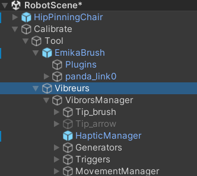

# Documentation for the utilisation of vibrors

## Path

All the objects and codes used to activate the vibrors are in the object : Vibreurs :

 

## GameObjects

### MovementManager

The purpose of this object is to disseminate various pieces of information from the GameManager, such as stim.visual, congruency, tactile.velocity, visual.velocity, to other objects. This information is used to configure the subsequent movement of the object and its trigger.

### Generators

This game object contains all the signal generators. These generators will use audio files that need to be named as follows: "signal" + frequency + "" + i + "" + speed. Here, "frequency" represents the signal frequency (solely for audio file identification, not used in calculations), "i" denotes the occurrence of the vibrator in the activation chain (ranging from 0 to 3), and "speed" represents the velocity of the tactile feedback. If you want to change the frequency that will be included in the signal name, you can directly modify the public value in the game object generator.

All audio files must be placed in the "Resources" folder within the Assets directory.

BE CAREFUL: If you use a tactile.velocity with a comma, you need to use a "-" instead of a "." in the audio file name. For example, use "signal120_0_0-5" instead of "signal120_0_0.5".

### Triggers 

This object contains a trigger for each vibrator device. The Trigger object moves with the tactile.velocity. When this object collides with the vibrators' zone, each trigger will provide its vibration source to the corresponding vibrator, activating each of these signals.
