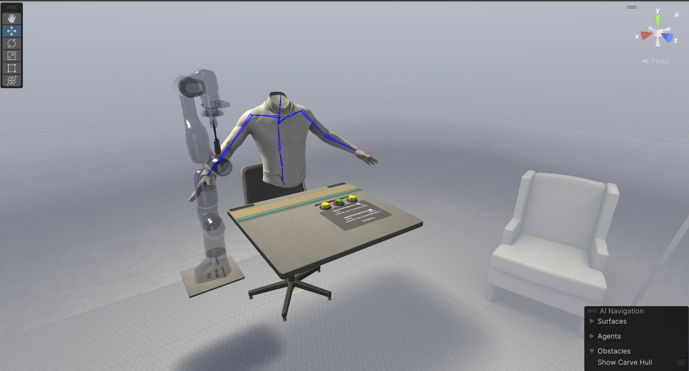
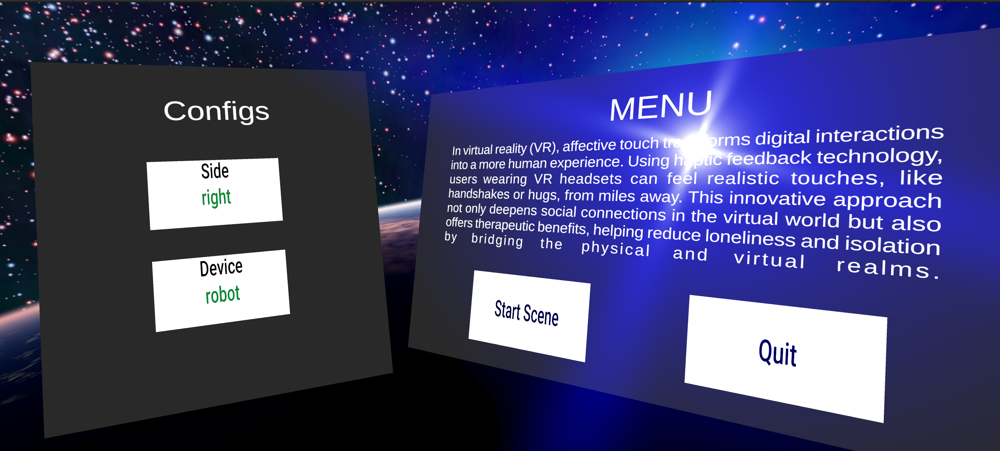

# PFE-Haptique

## Introduction
This project focuses on studying haptic feedback in virtual reality, specifically exploring affective touch. The setup includes various tools such as the Emika Franka robotic arm and a range of haptic devices. The project is a Unity virtual world experiment that connects to a robot or haptic devices to simulate haptic feedback. Users are then asked to evaluate the intensity and pleasantness of the feedback. Please note that this project is intended for research purposes.

## Images 
### Experiment Setup
 

### Main Menu


### User Interface

## Installation
This project uses redis as a message broker. You can install it on linux from the terminal using the following command:
```
sudo apt-get install redis-server
```
You can also install it on windows from the following link using memurai:
```
https://www.memurai.com/get-memurai
```
Once memurai is installed, you can start the redis server from the command line using the following command:
```
C:\Program Files\Memurai\memurai.exe
```
if the port is already in use, stop the service of memurai from services.msc and restart it again.


## Usage
Clone the repository and open in Unity. 


## TODO
- [x] Add main menu that requires controller to calibrate
- [x] Add calibration scene
- [x] Add calibration protocol
- [x] Add a communication between the headset and the computer to register data
