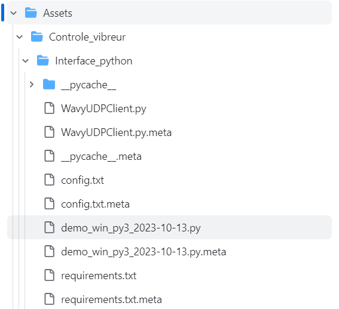
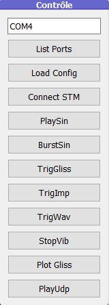
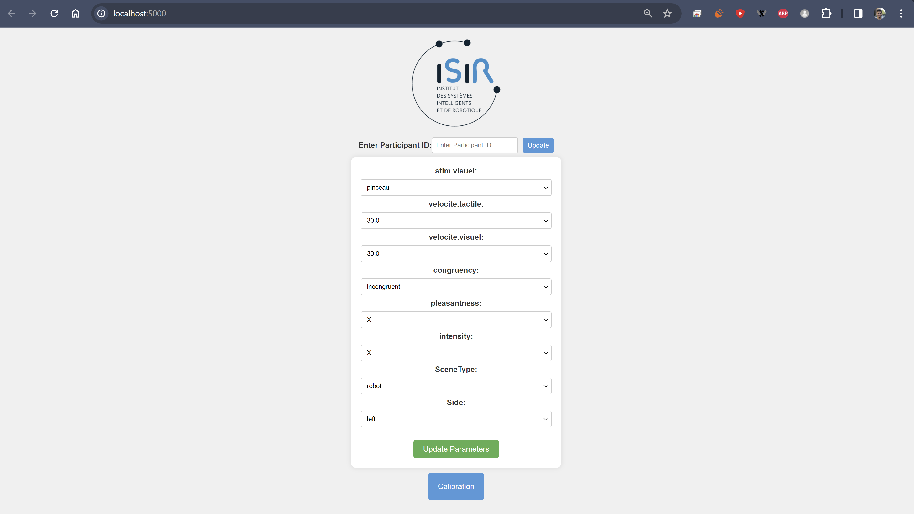

# PFE-Haptique

## Introduction
This project focuses on studying haptic feedback in virtual reality, specifically exploring affective touch. The setup includes various tools such as the Emika Franka robotic arm and a range of haptic devices. The project is a Unity virtual world experiment that connects to a robot or haptic devices to simulate haptic feedback. Users are then asked to evaluate the intensity and pleasantness of the feedback. Please note that this project is intended for research purposes.
## Video Tutorial 
### Launching the web interface and the UDP server
https://github.com/alhussein-jamil/PFE-Haptique/assets/85727835/5ac18c51-5858-4049-82f6-f2266cb169b8
### Example Usage 
https://github.com/alhussein-jamil/PFE-Haptique/assets/85727835/79dfa585-ff9c-4674-978f-58f3c2545a07

## Tutorial for vibrors

To start the connection of the vibrators, you need to plug them into a USB port of your choice. Then, execute the Python file: demo_win_py3_2023-10-13, present here :

 

Next, to configure the connection, you need to press "List Ports" in the control panel. In the terminal, you will be able to see the name of the USB port connected to the vibrator. Enter this name in the text window of the control panel. You can then press "Connect STM. Finally, you need to press "Play UDP," and you won't need to use this interface anymore.

 


## Images 
### Experiment Setup
 

### Main Menu


### User Interface


### Web Interface

## Installation
This project uses redis as a message broker. You can install it on linux from the terminal using the following command:
```
sudo apt-get install redis-server
```
You can also install it on windows from the following link using memurai:
```
https://www.memurai.com/get-memurai
```
Once memurai is installed, you can start the redis server from the command line using the following command:
```
C:\Program Files\Memurai\memurai.exe
```
if the port is already in use, stop the service of memurai from services.msc and restart it again.


## Usage
Clone the repository and open in Unity. 


## TODO
- [x] Add main menu that requires controller to calibrate
- [x] Add calibration scene
- [x] Add calibration protocol
- [x] Add a communication between the headset and the computer to register data
